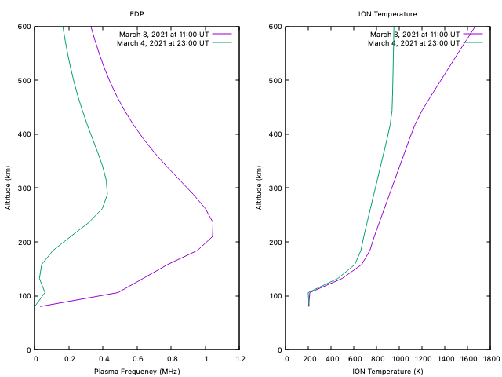

# README #

### What is this repository for? ###

Sample problems I attempted for your review.  I was able to get problems 1 through 4 completed. 

Problem 1 is working.  The iri2016 code compiles and links into a shared object, which is linkable to
a C driver function.  Values are passing into the Fortan subroutine iri_sub(), and produces data for the two dates and times requested.

Each problem directory has a README.txt with some details.

Thank you for your consideration,
  Gregg
